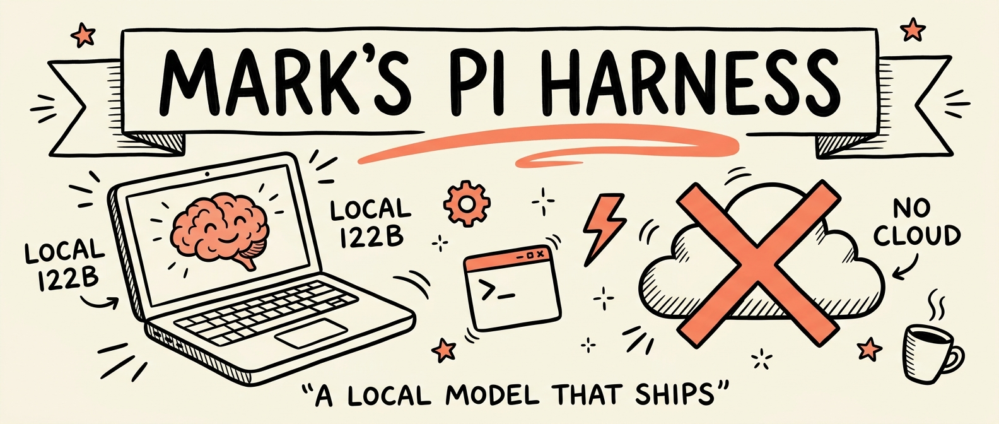
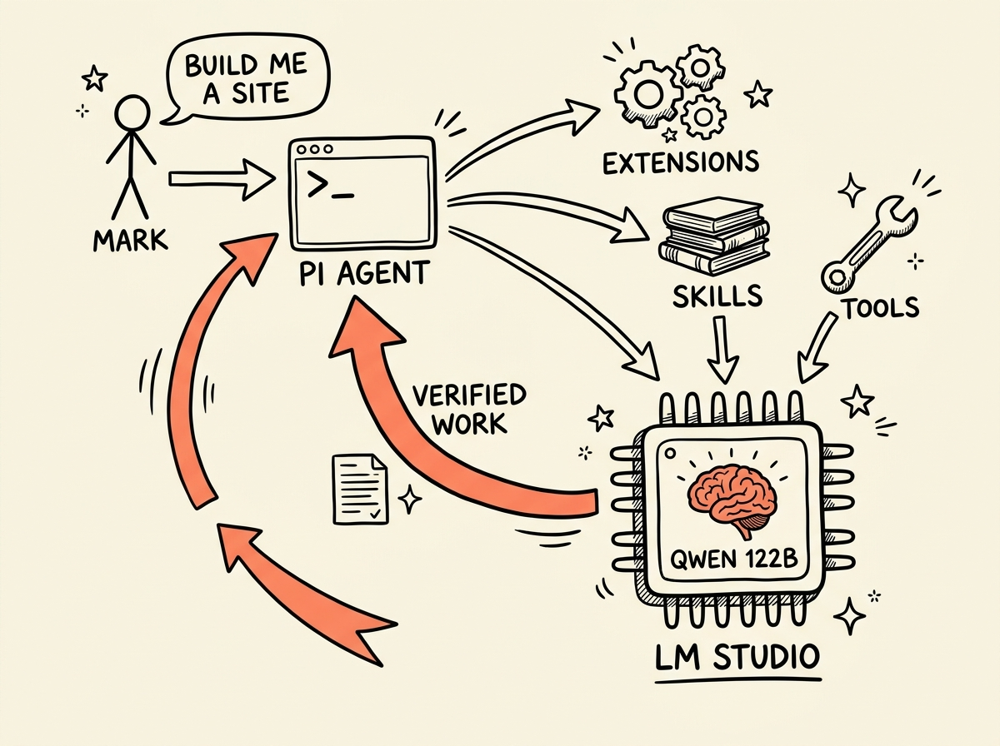
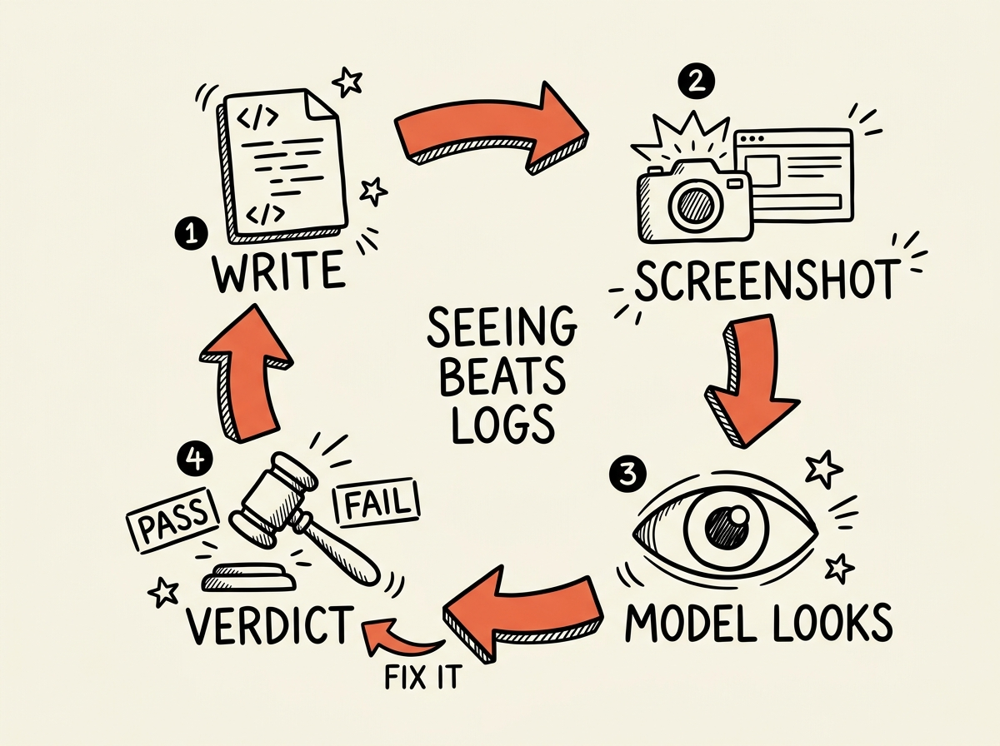
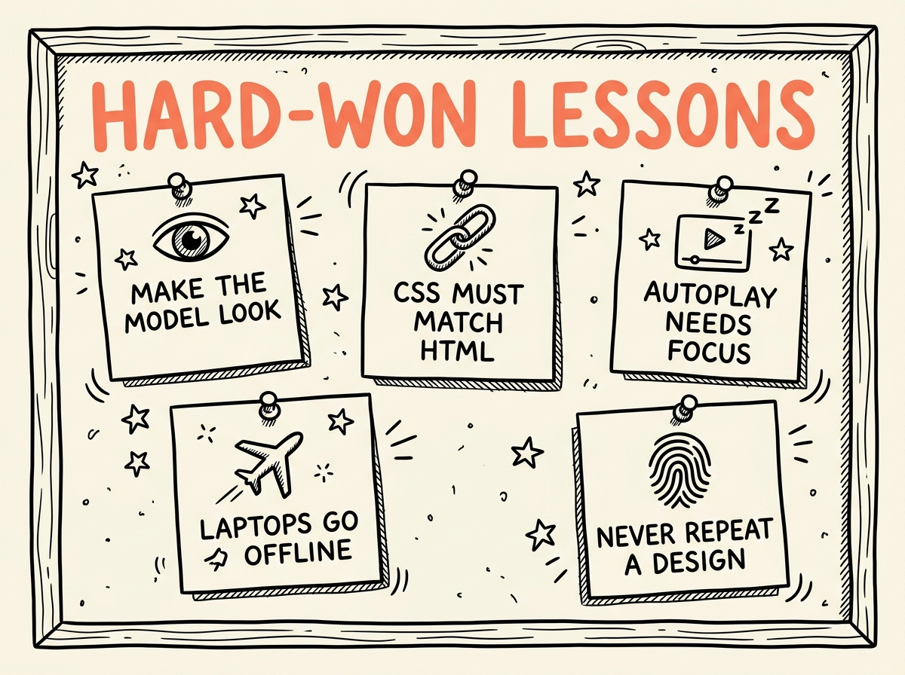

<p align="center">
  
</p>

# Mark's Pi Harness

This is the real, daily-driven config for the [pi coding agent](https://pi.dev) (`@earendil-works/pi-coding-agent`) running **100% local** against LM Studio on a MacBook. No cloud LLM. No API bill. No internet required. The workhorse model is Qwen3.5 122B (MLX) on Apple Silicon, and this harness is the difference between a local model that flails and a local model that one-shots complete, verified websites in headless mode with zero tool errors.

Everything in this repo lives in `~/.pi/agent/` on the source machine. Clone it, steal the pieces you want, or drop the whole thing into your own pi config.

**The receipts.** With this exact setup, a locally-hosted 122B has built full production websites end to end through `pi -p` (headless, no human in the loop): design system, copy, GSAP animation, video heroes, its own browser-based visual verification, and a passing production build. A session audit across four consecutive headless builds found zero tool-call errors and zero edit-retry loops.

---

## Table of contents

1. [Why local, and why a harness](#why-local-and-why-a-harness)
2. [How it all fits together](#how-it-all-fits-together)
3. [The extensions](#the-extensions)
4. [The verification loop that changes everything](#the-verification-loop-that-changes-everything)
5. [The skills](#the-skills)
6. [Headless mode, where it all pays off](#headless-mode-where-it-all-pays-off)
7. [Hard-won lessons](#hard-won-lessons)
8. [Design memory](#design-memory)
9. [Repo layout](#repo-layout)
10. [Setup](#setup)

---

## Why local, and why a harness

A frontier cloud model tolerates a sloppy setup. A local 122B does not. It will write CSS for HTML it never created, declare victory from log output, retry a failing command forever, and hang for 35 minutes on `brew install` when the wifi drops on a plane. None of that is fixed by a bigger prompt. It is fixed by **infrastructure**: tools that force the model to look at its work, gates it cannot talk its way past, guards that turn environmental chaos (offline, port conflicts, giant tool outputs) into structured signals it can act on.

That is what this harness is. Three layers, all included here:

- **`AGENTS.md`**, the standing rules. Working style, verification requirements, server discipline, code discipline, and the care rules for destructive actions.
- **`extensions/`**, 15 TypeScript modules pi loads at startup. They add tools (`browser_check`, `bash_background`, `task`, `web_search`, `facts_recall`), enforce discipline (gates, freshness, output caps, budget awareness), and adapt to the machine (offline detection, per-model prompt tuning).
- **`skills/`**, on-demand playbooks. Two are complete website-building systems with verified starter templates; one is a round-based deep-research method built for small contexts; two handle session continuity; two demonstrate the token-saving skill-pack router pattern.

## How it all fits together

<p align="center">
  
</p>

pi talks to LM Studio's OpenAI-compatible server on `localhost:1234` (`models.json` defines the provider and four models — including Meta's Muse Glimmer 30B GGUF — with compat quirks like Qwen's chat-template thinking format; `settings.json` scopes the model picker to `lmstudio/*` so hosted-provider catalogs stay out of the way). Extensions register extra tools and lifecycle hooks. Skills load into context only when the skillrouter detects they are needed, keeping the always-on prompt small, which matters double locally because **LM Studio does no prompt caching**, so every wasted token is reprocessed every single turn.

The loop that matters is the coral one: work does not come back to the user until it has been *verified*, which for anything with a UI means the model has literally looked at a screenshot of it.

## The extensions

| Extension | Category | What it does |
|---|---|---|
| [`browser.ts`](extensions/browser.ts) | verification | The crown jewel. Adds a `browser_check` tool: headless system Chrome via playwright-core (`channel: "chrome"`, no 200 MB browser download) captures a JPEG screenshot plus console errors plus failed network requests, and returns them as image content blocks. Local vision models literally see their work. Supports an `expect` string that forces an explicit `VERDICT: PASS` or `VERDICT: FAIL`, plus `mobile: true` dual-viewport, `scrollTo`, and `clickSelector`. |
| [`gate.ts`](extensions/gate.ts) | verification | `/goal` declares success criteria up front, `/gate` registers commands that must exit 0, and `goal_complete` refuses to let the session end while gates fail. Includes workspace-unchanged loop detection, so an agent that keeps "fixing" without actually changing files gets caught. Ported from the prime-agent fork. |
| [`freshness.ts`](extensions/freshness.ts) | discipline | Blocks edits against stale file state, killing the edit-fails-retry-loop failure class. |
| [`netguard.ts`](extensions/netguard.ts) | environment | Detects offline state and blocks installs/fetches with a clear `OFFLINE` signal instead of letting a package manager hang forever. Also applies default bash timeouts. Born from a real 35-minute offline `brew install` hang. |
| [`compactor.ts`](extensions/compactor.ts) | environment | Caps any single tool result at ~30k chars (~7.5k tokens) and watches context usage against the model's window. Context discipline is survival when there is no prompt caching. |
| [`modelfit.ts`](extensions/modelfit.ts) | environment | Injects per-model-size prompt notes. Small models get sterner tool-calling guidance because some of them (looking at you, Mistral Small in pi) emit raw `[TOOL_CALLS]` tokens as text and then claim they have no tools. |
| [`web.ts`](extensions/web.ts) | tools | Search and fetch hardened by a live small-model session audit. `web_search` takes an ARRAY of 2-5 different-intent queries fused with reciprocal-rank fusion, a `days` window with real date filtering (Brave `freshness`, HN Algolia, GitHub `created:`, Reddit `t=`; DDG fallthrough gets labeled "unwindowed"), and optional keyless sources (`hn`, `github`, `reddit`). `web_fetch` routes by content type first (YouTube → yt-dlp transcript, GitHub → gh CLI, RSS/Atom → parsed directly), then climbs jina reader → direct fetch → **headless Chrome render**, with content-quality gates (empty/markup output is an explicit ERROR, never a silent success), JSON-LD/og-meta `[structured data]` extraction that pulls price/stock through JS walls, bot-challenge fingerprints, ad-redirect filtering, cross-search URL dedup, and per-URL junk memory that refuses doomed retries. A `goal` param returns goal-relevant excerpts (instant sliding-window filter) instead of the whole page. Zero required keys; everything degrades gracefully. |
| [`facts.ts`](extensions/facts.ts) | tools | Persistent research memory. A small model with no prompt caching loses page 1 by the time it reads page 6; `facts_add`/`facts_recall`/`facts_seen` fix that with a per-project SQLite store (FTS5) carrying provenance (source URL + verbatim quote + date), three-tier confidence (EXTRACTED/INFERRED/AMBIGUOUS), write-time entity aliasing ("Anthropic" = "Anthropic PBC" forever, no LLM in the loop), corroboration counting, and numeric-contradiction flagging. Facts survive across sessions; `facts_seen` stops the agent re-fetching pages it already mined. |
| [`budget.ts`](extensions/budget.ts) | discipline | Injects one line per turn: tool calls spent, context %, and the dig-vs-pivot rule (ample budget → dig deeper; low → pivot or commit). Mechanical stall detection: 3+ near-identical tool calls triggers "pivot STRUCTURE, not parameters." Small models burn twenty calls circling one dead lead; a visible countdown turns that judgment into arithmetic. |
| [`background.ts`](extensions/background.ts) | tools | `bash_background`, `background_status`, `background_kill`. Dev servers and watchers run detached with named logs, because pi's bash tool blocks until exit and a foreground `npm run dev` would hang the session. |
| [`subagent.ts`](extensions/subagent.ts) | tools | A `task` tool that delegates self-contained grunt work to a faster tier, keeping only the conclusion in the main context. |
| [`skillrouter.ts`](extensions/skillrouter.ts) | routing | Maps natural phrasing to skills. "Editorial site" routes to editorial-web, "cinematic 3D site" to immersive-web, "wrap up" to handoff, "where were we" to prime. Order matters: the editorial route sits above the immersive route so each genre lands on its own playbook. |
| [`guard.ts`](extensions/guard.ts) | safety | Regex blocklist for catastrophic commands: disk-level destruction, force pushes, recursive deletes of roots, and friends. |
| [`watchdog.ts`](extensions/watchdog.ts) | safety | Session watchdog that keeps an eye on runaway behavior. |
| [`todo.ts`](extensions/todo.ts) | discipline | Todo widget with an enforced rule: exactly one item in_progress at a time, updated the moment a step finishes. |
| [`clear.ts`](extensions/clear.ts) | quality of life | `/clear` starts a fresh session in place (alias for the built-in `/new`), for muscle memory carried over from other agent CLIs. |

## The verification loop that changes everything

<p align="center">
  
</p>

The single biggest reliability upgrade in this harness is refusing to let the model grade its own homework from logs. `AGENTS.md` mandates the loop above for anything with a UI, and adds two teeth:

1. **`expect` forces a verdict.** `browser_check` is called with an expectation string ("hero video playing, serif headline at ~10vw, no console errors") and the model must answer `VERDICT: PASS` or `VERDICT: FAIL` with a reason. No vibes, no "looks good to me" from a build log.
2. **Nothing on the page is someone else's problem.** A banned move, spelled out in the rules after it actually happened twice: dismissing a console 404 as "unrelated" or "pre-existing". Every asset and script the page references is the agent's to prove working (curl it, expect 200) or to fix, before the work is called done.

Because every model in `models.json` is vision-capable, this works with plain local models. The 122B has caught its own missing assets, mis-sized type, and stuck videos this way.

## The skills

<p align="center">
  
</p>

### `immersive-web/`, award-tier cinematic sites

Teaches pi to build the igloo.inc / landonorris.com class of site, distilled from reverse-engineering shipped award-site bundles. Three archetypes, each with its own reference doc:

- **WebGL scroll-narrative**: Three.js + GSAP ScrollTrigger + Lenis, shader hero, scroll-driven scene morphs. Ships a browser-verified Vite starter in [`assets/template/`](skills/immersive-web/assets/template/) (preloader, shader hero, scroll choreography all working out of the box).
- **Video-driven, zero WebGL**: pre-rendered VP9 loops composited with DOM scrims and springs doing convincing fake 3D. Dramatically simpler, and how more award sites work than you would guess.
- **Scroll-scrubbed video**: hand the agent ONE video and it becomes the site's spine. [`scripts/setup-scrub.sh`](skills/immersive-web/scripts/setup-scrub.sh) probes it with ffprobe, extracts frames at the right fps/scale, injects frame count and scroll runway into the [`template-scrub/`](skills/immersive-web/assets/template-scrub/) starter, and prints the remaining `{{TOKENS}}`. The skill then instructs the agent to *watch the video* (vision again) and narrate the journey in overlaid text beats.

Also in the box: an asset pipeline doc (Draco GLB, WebP/KTX2, WOFF2, honest loading progress), a shader cookbook, scroll choreography patterns, and a variation-axes doc so no two builds look alike. Plus [`scripts/enhance-video.sh`](skills/immersive-web/scripts/enhance-video.sh), free on-device Real-ESRGAN upscaling with optional RIFE frame interpolation.

### `editorial-web/`, premium editorial DOM sites

The second genre: expressive serif display type, soft warm canvases, rounded and arch-topped media plates, alternating feature rows, card rails, calm reveals, zero WebGL. The genre of high-end SaaS and brand sites that feel like a beautifully typeset magazine.

- A verified Vite + GSAP + Lenis starter in [`assets/template-editorial/`](skills/editorial-web/assets/template-editorial/) where ALL theming flows from a `:root` token block. Retheme by editing tokens, never by hunting selectors.
- [`references/editorial-anatomy.md`](skills/editorial-web/references/editorial-anatomy.md) locks the scale rules that make these pages feel expensive, including the big one: **heroes at 9-11vw, and a hero that could be mistaken for a section heading is a FAIL.**
- [`references/variation.md`](skills/editorial-web/references/variation.md), eight axes (type pairing, hero alignment, plate geometry, accent strategy...) the agent must walk so consecutive sites diverge.
- [`references/effects.md`](skills/editorial-web/references/effects.md), a ten-recipe effects menu with exact code: magnetic buttons, custom cursor dot, film grain, clip-path reveals, 3D tilt cards, anime.js v4 character cascades, SVG line-draw, scroll progress hairline, count-up stats, velocity skew. Rules: pick 2-4 per site, they must agree with the mood, everything guarded by `prefers-reduced-motion`, console must stay clean.

This is the skill a local 122B has one-shotted complete sites through, twice in a row, with genuinely different design decisions each time.

### `deep-research/`, research that survives a small context

Web research is where raw ReAct history kills small models: by page 6 the model has lost page 1, and its own earlier speculation starts reading like established fact. This skill replaces accumulation with **rounds**. Think (scratch, deliberately discarded), Report (rewritten from scratch each round, the only survivor), Action (one batched search or 1-3 goal-scoped fetches). Verified facts go to the `facts.ts` store; failures go to a binding FAILED ledger so nothing gets retried; a restart protocol rebuilds from (question + latest report) when context climbs. Before answering, a fixed verification checklist runs: every claim traces to fetched content, entities match, dates hold, the user's actual constraint is addressed, and "nothing solid found" is a legitimate answer stated plainly. The round structure is adapted from the 2025-26 deep-research literature (IterResearch/ReSum/RE-TRAC, the parts that work at 27B scale without any training).

### `handoff/` + `prime/`, session continuity

The pair that gives pi memory across sessions. `handoff` writes a cold-start-ready summary (state, locked decisions, next steps, landmines) into the project's `handoff/` folder with timestamped files and a `LATEST.md` pointer. `prime` reads it back at the start of the next session and briefs before touching anything. The skillrouter wires "wrap up" and "where were we" straight to them. Round-tripped and verified across real sessions.

### `video-pack/` + `apify-pack/`, the skill-pack router pattern

Two tiny router skills that demonstrate how to keep a big skill library out of the always-on prompt. The full specialist packs (18 video skills, 14 scraping skills) live outside the harness; these routers carry only a one-line-per-skill table and load the ONE relevant specialist on demand. Net saving: thousands of tokens per turn, which on an uncached local model is thousands of tokens *every* turn. The packs themselves are not in this repo; the pattern is the point.

## Headless mode, where it all pays off

<p align="center">
  
</p>

The exam for all of this is `pi -p`: pipe in a written brief, walk away, come back to a finished site. Real numbers from this harness: one editorial site built clean in 49 assistant turns, a second (with deliberately different design picks) in 72, and two follow-up effects passes in 21 and 14. Zero tool errors across all four sessions.

Headless mode has its own traps, and the skills encode the fixes:

- **No slash commands exist under `-p`**, so `/gate` is unavailable. The skills instruct the agent to self-run its gate commands (`npm run build`, contract checks, browser_check sweep) before declaring the build done.
- **Skills and extensions load at startup.** A session started before a skill edit never sees the edit. Restart, don't wonder.
- **Sequential beats parallel** when two builds would contend for one LM Studio instance. This machine hosts a ~70 GB model; the rules flatly ban loading a second one because memory exhaustion takes down the whole machine.

## Hard-won lessons

<p align="center">
  
</p>

Every one of these is baked into a rule, gate, or template because it bit for real first:

- **Make the model look.** Vision + screenshot + forced verdict beats any amount of "be careful" prompting. Declaring web work done from logs alone is banned outright.
- **CSS must match HTML.** A 122B once wrote a lovely `.banner__bg` / `.banner__overlay` style block for divs it never added to the page, shipping a cream-on-cream invisible section. The editorial skill now has a mandatory contract check: every class selector added to the stylesheet must exist in the markup.
- **Autoplay needs focus.** Chrome keeps `<video autoplay muted>` at `readyState 0` *forever* in a tab that has never been focused. Hours were spent chasing that phantom. Both templates now ship a poster frame plus an explicit `load()`/`play()` kick on `visibilitychange`.
- **Laptops go offline.** Planes and cafes are part of the runtime environment. netguard turns "hang for 35 minutes" into a clean `OFFLINE` block the model is told not to argue with.
- **Never repeat a design.** See [Design memory](#design-memory) below.
- **If the user says nothing changed, stop editing.** The fix did not land. Prove the previous change reached the browser (right file, rebuild happened, cache busted, styles not overridden) before stacking another edit on top. This rule alone kills the most demoralizing local-model failure spiral.

## Design memory

[`design-history.md`](design-history.md) is an append-only registry. Every generated site records its picks (type pairing, hero alignment, plate geometry, accent, section break style) as one line, and the skills require checking it before designing: **combinations may not repeat**. This is how the second editorial site came out with Cormorant + Sora, a left-set hero, and arch-topped plates when the first had used Fraunces + Inter, centered, with rounded plates. Cheap to maintain, and it is the difference between "a generator with one taste" and a studio.

## Repo layout

```
AGENTS.md                      standing rules, read every session
settings.json                  pi settings (local default model, compaction reserve)
models.json                    LM Studio provider + 3 model defs with compat quirks
design-history.md              append-only no-repeat design registry
extensions/                    15 TypeScript extensions (see table above)
skills/
  deep-research/
    SKILL.md                   round-based research: report rewriting, facts
                               store, failed ledger, verification checklist
  immersive-web/
    SKILL.md                   archetype picker + build pipeline + verification rules
    references/                archetypes, shaders, scroll choreography, asset
                               pipeline, scrub-video, video-driven, variation axes
    scripts/                   setup-scrub.sh, enhance-video.sh
    assets/template/           verified Vite + Three + GSAP + Lenis starter
    assets/template-scrub/     verified scroll-scrubbed-video starter with {{TOKENS}}
  editorial-web/
    SKILL.md                   pipeline + gates incl. CSS-markup contract check
    references/                editorial anatomy, variation axes, 10-recipe effects menu
    assets/template-editorial/ verified Vite + GSAP + Lenis editorial starter
  handoff/  prime/             session continuity pair
  video-pack/  apify-pack/     skill-pack router pattern demos
docs/img/                      the doodles in this README
```

Not included, on purpose: `auth.json`, `trust.json`, session transcripts, and the cached model catalog.

## Setup

1. **Install pi.** `brew install earendil-works/tap/pi`, or see [pi.dev](https://pi.dev).
2. **Run LM Studio** with the local server on `localhost:1234` and a **vision-capable** model loaded (adjust `models.json` to whatever you run; the vision part is what makes `browser_check` sing). Raise LM Studio's default context length in its settings; the stock 8192 will hard-fail against a real system prompt plus a loaded skill.
3. **Drop this repo's contents into `~/.pi/agent/`.**
4. **`npm install` inside `~/.pi/agent/`.** That pulls playwright-core for `browser_check`; it drives your existing system Chrome, no browser download.
5. Optional keys in `~/.env` for nicer web search: `BRAVE_API_KEY` (free tier, the biggest single upgrade, real date filtering and no captcha roulette), `JINA_API_KEY`, `OPENROUTER_API_KEY`. Everything degrades gracefully without them.
6. Optional binaries for content-type routing: `yt-dlp` (YouTube transcripts) and `gh` (GitHub issues/PRs/repos, uses your existing auth). Without them those URLs just fall through to the normal fetch ladder. Optional `PI_EXTRACT_MODEL` in `~/.env` names a SMALL fast LM Studio model for LLM-grade goal extraction; unset, the instant sliding-window filter is used instead (a reasoning model spends minutes per page, don't point this at one).

Then open a project and ask for an editorial site, and watch a local model check its own work in the mirror until it passes.

## License

MIT. The doodles were generated with Nano Banana (Gemini image gen) and are yours to reuse with the repo.
